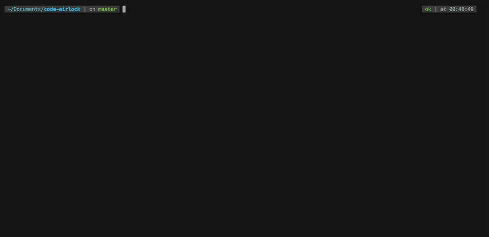

# code-airlock

[](https://github.com/Trivo25/code-airlock/actions/workflows/shellcheck.yml)

Run Claude Code, Codex, OpenCode, or another coding agent in a disposable microVM, then review its work as normal git commits.



Code Airlock is a small wrapper around [Docker Sandboxes](https://docs.docker.com/ai/sandboxes/) for people who want to let coding agents work with fewer prompts without giving them direct access to the host machine.

## Why Use It

Coding agents are most useful when they can install packages, run tests, inspect failures, and iterate without asking before every command. That is also exactly when you want a stronger boundary than process-level deny rules.

Code Airlock keeps the workflow simple:

| You want | Code Airlock does |
| --- | --- |
| Run agents unattended | Starts the selected agent inside a Docker Sandbox microVM |
| Keep your local repo clean | Uses clone mode, so the host repo is mounted read-only |
| Review everything first | Pulls sandbox commits back with `fetch`, `diff`, and `merge` |
| Limit network access | Can apply a configurable allowlist for model APIs and package registries |
| Switch agents | Uses `AGENT=claude`, `AGENT=codex`, `AGENT=opencode`, and other Docker Sandbox agents |

## Why Not Just Use `sbx` Directly?

You can. Code Airlock is intentionally a thin wrapper around Docker Sandboxes, not a replacement for it.

Use `sbx` directly when you want full control over sandbox lifecycle, policies, kits, and one-off experiments. Use Code Airlock when you want the common coding-agent loop already wired together:

- clone mode by default
- stable sandbox naming per repo
- one-command agent startup
- repo-local `AGENTS.md` scaffolding
- `fetch`, `diff`, `review`, and `merge` commands for the sandbox branch
- a documented credential and network-policy path for Claude Code, Codex, and OpenCode

The point is to make the safe workflow boring and repeatable while still leaving `sbx` available underneath.

## Quick Start

Install Docker Sandboxes first. On Linux:

```bash
curl -fsSL https://get.docker.com | sudo REPO_ONLY=1 sh
sudo apt-get install docker-sbx
sudo usermod -aG kvm $USER
newgrp kvm
sbx login
```

On macOS and Windows, follow Docker's [official install guide](https://docs.docker.com/ai/sandboxes/get-started/).

Install Code Airlock with npm:

```bash
npm install -g code-airlock
```

Or use the standalone shell installer:

```bash
curl -fsSL https://raw.githubusercontent.com/Trivo25/code-airlock/main/install.sh | sh
```

The shell installer also adds a short `codelock` alias when that command is not already taken:

```bash
codelock up
codelock status
codelock attach
```

The npm package intentionally installs only `code-airlock`, because `codelock` is already an npm package name. Add a personal shell alias if you want the shorter command after npm install:

```bash
alias codelock=code-airlock
```

Or clone it manually:

```bash
git clone https://github.com/Trivo25/code-airlock.git
cd code-airlock
ln -s "$PWD/code-airlock" ~/.local/bin/code-airlock
```

The installer writes to `~/.local/bin` by default. Choose another location with:

```bash
curl -fsSL https://raw.githubusercontent.com/Trivo25/code-airlock/main/install.sh | PREFIX=/usr/local/bin sh
```

Skip or rename the short alias:

```bash
curl -fsSL https://raw.githubusercontent.com/Trivo25/code-airlock/main/install.sh | CODE_AIRLOCK_INSTALL_ALIAS=0 sh
curl -fsSL https://raw.githubusercontent.com/Trivo25/code-airlock/main/install.sh | CODE_AIRLOCK_ALIAS=calock sh
```

## Install - Agent

Already using a coding agent? Send it this:

```text
Install Code Airlock in this environment, then run its first-run checks.

Use npm when available:
npm install -g code-airlock

If npm is unavailable, use:
curl -fsSL https://raw.githubusercontent.com/Trivo25/code-airlock/main/install.sh | sh

After install, make sure code-airlock is on PATH, then run:
code-airlock doctor
code-airlock --dry-run up

Do not start a real sandbox or change network policy unless I explicitly ask.
```

Run it from the repo you want the agent to work on:

```bash
cd ~/code/my-project
code-airlock doctor       # check sbx, virtualization, login, and git
code-airlock --dry-run up # preview the sbx commands without running them
code-airlock init         # optional: add starter AGENTS.md instructions
code-airlock up           # start Claude Code in a sandbox
code-airlock --seed-config up # optionally copy user-level agent customizations
code-airlock status       # see this repo's sandbox and tmux session
```

On a remote server, keep the agent running after your SSH connection closes:

```bash
code-airlock --tmux up # detach with Ctrl-b, then d
code-airlock attach    # reattach later
```

Use another agent:

```bash
AGENT=codex code-airlock up
AGENT=opencode code-airlock up
```

When the agent has made changes, review them from your host:

```bash
code-airlock fetch
code-airlock diff
code-airlock review      # optional: open a visual diff
code-airlock merge
```

## How It Works

Code Airlock starts Docker Sandboxes with `--clone`:

1. Docker creates a private clone inside the sandbox VM.
2. The agent edits and commits inside that clone.
3. Your host repo stays read-only while the agent runs.
4. You fetch the sandbox branch into your local repo and review the diff.
5. You merge only when you are satisfied.

This means uncommitted sandbox edits do not come back through the normal flow. If needed, enter the sandbox and commit first:

```bash
code-airlock shell
git status
git add -A
git commit -m "describe the agent work"
exit
```

Then fetch and review from the host.

## First-Run Checks

Most setup failures come from missing Docker Sandboxes, missing KVM/virtualization support, or an unauthenticated `sbx` CLI. Check before launching:

```bash
code-airlock doctor
```

Preview what Code Airlock would run without creating a sandbox:

```bash
code-airlock --dry-run up
```

Dry-run mode prints the `sbx` and git commands instead of running them. It is useful on machines that cannot run KVM yet, or when you want to understand the workflow before creating a VM.

## Remote / Server Runs

Use `--tmux` to start the sandboxed agent inside a host-side tmux session:

```bash
code-airlock --tmux up
```

This attaches immediately so you can talk to the coding agent. To disconnect without stopping it, press `Ctrl-b`, then `d`. This detaches your terminal and leaves the agent running in the tmux session. Reattach later with:

```bash
code-airlock attach
```

For an unattended server run, start the tmux session without attaching:

```bash
code-airlock --tmux-detached up
```

The default session name is `code-airlock-<sandbox-name>`. Override it with:

```bash
TMUX_SESSION=agent-work code-airlock --tmux up
TMUX_SESSION=agent-work code-airlock attach
```

For a visual review, use:

```bash
code-airlock review
```

This fetches the sandbox branch and opens a Git directory diff using VS Code by default. Your working tree is not modified by the review command.

Use another Git difftool:

```bash
REVIEW_TOOL=opendiff code-airlock review
REVIEW_TOOL=vimdiff code-airlock review
```

## Agent Instructions

Agents work better when the repo contains concise project instructions. Code Airlock can create a starter file:

```bash
code-airlock init
```

This writes `AGENTS.md` in the target repo only if one does not already exist. `code-airlock up` will mention the command when no `AGENTS.md` is present, but it will not silently modify your working tree.

## Config Seeding

By default, a sandbox starts with a fresh agent home directory. Project files that are committed to Git come through clone mode, but personal commands, skills, subagents, and global instructions from your host home directory do not.

Opt in to copying curated user-level config before the agent starts:

```bash
code-airlock --seed-config up
```

This changes startup from one `sbx run` call to:

```bash
sbx create --clone ...
sbx cp ...
sbx run --name ...
```

Default seeded paths:

| Agent | Paths |
| --- | --- |
| Claude Code | `~/.claude/CLAUDE.md`, `~/.claude/commands/`, `~/.claude/agents/`, `~/.claude/skills/` |
| Codex | `~/.codex/AGENTS.md`, `~/.codex/AGENT.md`, `~/.codex/agents/`, `~/.codex/skills/`, `~/.codex/prompts/` |
| OpenCode | `~/.config/opencode/AGENTS.md`, `~/.config/opencode/opencode.jsonc`, `~/.config/opencode/commands/`, `~/.config/opencode/agents/`, `~/.config/opencode/skills/` |

Code Airlock does not copy auth files, histories, logs, caches, session state, or `node_modules` by default. Credentials should still go through Docker Sandboxes' secret manager.

Copy explicit extra user-level paths with:

```bash
SEED_PATHS="$HOME/.codex/config.toml,$HOME/.claude/settings.json" code-airlock --seed-config up
```

`SEED_PATHS` entries must be under `$HOME`; secret-like paths are skipped. Gitignored project-local files are not copied by default. Prefer committing project instructions such as `AGENTS.md`, `CLAUDE.md`, and `.claude/commands/` when they are meant to travel with the repo.

## Authentication

Model credentials should go through Docker Sandboxes' secret manager or host-side auth flow, not be pasted into the VM.

Common setup:

```bash
sbx secret set -g anthropic          # Claude Code API key
sbx secret set -g openai --oauth     # Codex OAuth
sbx secret set -g openai             # Codex/OpenCode API key
```

Agent-specific notes:

| Agent | Authentication |
| --- | --- |
| Claude Code | Run `code-airlock up` and use `/login` inside Claude, or store an Anthropic key with `sbx secret set -g anthropic` |
| Codex | Use `sbx secret set -g openai --oauth`, `sbx secret set -g openai`, or export `OPENAI_API_KEY` before launch |
| OpenCode | Store the provider keys you use, such as `openai`, `anthropic`, `google`, `xai`, `groq`, `aws`, or `openrouter` |

Sandboxes do not carry user-level config such as `~/.claude` or `~/.codex` into the VM by design. Put project-level config in the repo if the agent needs it.

### GitHub Credentials

Code Airlock does not need GitHub credentials for the normal fetch/diff/merge review loop.

Give the sandbox GitHub access only if you want the agent to use `gh`, open pull requests, create issues, or push directly from inside the VM:

```bash
echo "$(gh auth token)" | sbx secret set -g github
```

Global secrets apply when a sandbox is created. For an existing sandbox, either recreate it or scope the token to that sandbox:

```bash
echo "$(gh auth token)" | sbx secret set sandbox-sbx-my-project github
```

If you use SSH remotes, Docker Sandboxes can forward your host SSH agent when `SSH_AUTH_SOCK` is set. The private key stays on the host; sandboxed processes can request signatures but cannot read the key.

## Network Policy

On first use, Code Airlock initializes Docker Sandboxes' global network policy to `balanced` if it has not been initialized yet.

Override that default:

```bash
GLOBAL_NETWORK_POLICY=deny-all code-airlock up
GLOBAL_NETWORK_POLICY=allow-all code-airlock up
```

For stricter runs, use:

```bash
code-airlock lockdown
```

Run `lockdown` after the sandbox exists. It sets Docker Sandboxes' global default to deny-all, then applies Code Airlock's allowlist to the named sandbox.

Undo the global policy change with:

```bash
code-airlock unlock
```

`unlock` runs `sbx policy reset`, which restores Docker Sandboxes' policy defaults.

The default allowlist covers Anthropic, OpenAI, GitHub, and npm:

```bash
api.anthropic.com,*.anthropic.com,api.openai.com,*.openai.com,github.com,*.github.com,codeload.github.com,objects.githubusercontent.com,registry.npmjs.org,*.npmjs.org
```

Customize it with `sandbox.conf`:

```bash
# sandbox.conf
AGENT=codex
ALLOW=api.openai.com,*.openai.com,github.com,*.github.com,registry.npmjs.org,*.npmjs.org
```

If a download fails, inspect blocked hosts:

```bash
code-airlock net
```

## Headless Runs

Pass agent arguments after `--`.

Claude Code:

```bash
code-airlock up -- -p "add pagination to the users endpoint and run the test suite"
```

Codex:

```bash
AGENT=codex code-airlock up -- --dangerously-bypass-approvals-and-sandbox "fix the build"
```

OpenCode defaults to a TUI. Pass OpenCode's own flags after `--` when you need session-specific behavior.

## Configuration

Copy `sandbox.conf.example` to `sandbox.conf` and edit:

```bash
cp sandbox.conf.example sandbox.conf
```

Useful settings:

```bash
SANDBOX_NAME=sbx-my-project
AGENT=claude
REPO_DIR=/absolute/path/to/repo
GLOBAL_NETWORK_POLICY=balanced
REVIEW_TOOL=vscode
TMUX_SESSION=code-airlock-sbx-my-project
TMUX_ATTACH=1
SEED_CONFIG=0
SEED_PATHS=$HOME/.codex/config.toml,$HOME/.claude/settings.json
ALLOW=api.anthropic.com,*.anthropic.com,github.com,*.github.com
```

`sandbox.conf` is git-ignored.

## Commands

| Command | What it does |
| --- | --- |
| `up [-- agent-args]` | Create and start the sandbox in clone mode with the selected agent |
| `doctor` | Check `sbx`, virtualization/KVM, git, daemon reachability, and login status |
| `status` | Show this repo's sandbox and tmux session status |
| `attach` | Attach to this repo's Code Airlock tmux session |
| `init` | Create a starter `AGENTS.md` in the target repo |
| `shell` | Open a shell inside the running sandbox |
| `fetch` | Fetch the sandbox commits into your local repo |
| `diff [base]` | Fetch, then show `base..sandbox-<name>/base` |
| `review [base]` | Fetch, then open a visual Git difftool review |
| `merge [base]` | Fetch, then merge the sandbox branch into `base` |
| `net` | Show allowed and blocked network hosts |
| `stop` | Stop the sandbox but keep its VM and commits |
| `rm` | Remove the sandbox and repo tmux session after offering to fetch commits |
| `lockdown` | Set the global policy to deny-all and apply the allowlist to an existing sandbox |
| `unlock` | Reset Docker Sandboxes policies with `sbx policy reset` |

Global option:

| Option | What it does |
| --- | --- |
| `--dry-run` | Print commands instead of running them |
| `--tmux` | Run `up` inside a host-side tmux session and attach |
| `--tmux-detached` | Run `up` inside a detached host-side tmux session |
| `--seed-config` | Copy curated user-level agent config before starting |

## Security Notes

- The isolation boundary is the Docker Sandbox microVM, not the agent's own permission model.
- Clone mode keeps your host repo mounted read-only.
- `lockdown` sets the default network policy to deny-all for all Docker Sandboxes. Revert with `code-airlock unlock`.
- Keep the allowlist as narrow as the task allows. Allowed hosts remain possible egress paths.
- Do not give the sandbox broad credentials unless the task truly requires them.
- `code-airlock rm` deletes the sandbox clone. Fetch or push anything you want to keep first.

## Requirements

- macOS: Apple Silicon
- Linux: KVM enabled (`lsmod | grep kvm`)
- Windows: Windows 11 with Hypervisor Platform, run under WSL2
- Git
- Docker Sandboxes CLI (`sbx`)

## License

MIT. See [LICENSE](LICENSE).
